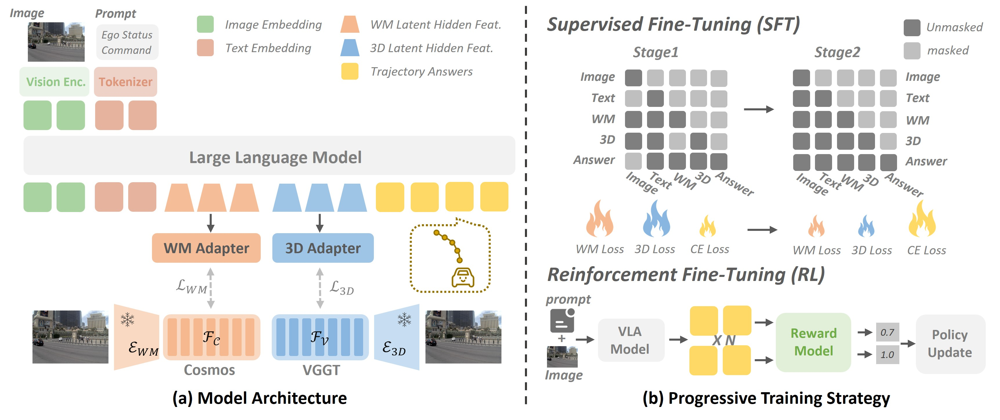
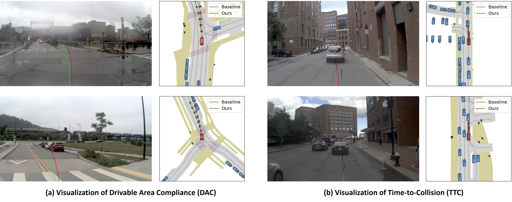

<div align="center">

<h1 align="center">LaST-VLA: Thinking in Latent Spatio-Temporal Space for Vision-Language-Action in Autonomous Driving</h1>

[](xxx)
[](xxx)

</div>

## 📖 Abstract

While Vision-Language-Action (VLA) models have revolutionized autonomous driving by unifying perception and planning, their reliance on explicit textual Chain-of-Thought (CoT) leads to semantic-perceptual decoupling and perceptual-symbolic conflicts. Recent shifts toward latent reasoning attempt to bypass these bottlenecks by thinking in continuous hidden space. However, without explicit intermediate constraints, standard latent CoT often operates as a physics-agnostic representation. To address this, we propose the Latent Spatio-Temporal VLA (LaST-VLA), a framework shifting the reasoning paradigm from discrete symbolic processing into a physically grounded Latent Spatio-Temporal CoT. By implementing a dual-feature alignment mechanism, we distill geometric constraints from 3D foundation models and dynamic foresight from world models directly into the latent space. Coupled with a progressive SFT training strategy that transitions from feature alignment to trajectory generation, and refined via Reinforcement Learning with Group Relative Policy Optimization (GRPO) to ensure safety and rule compliance. LaST-VLA setting a new record on NAVSIM v1 (91.3 PDMS) and NAVSIM v2 (87.1 EPDMS), while excelling in spatial-temporal reasoning on SURDS and NuDynamics benchmarks.

## 🚀 Overview

<div align="center">
  
  <br>
  <div style="color: #555; width: 800px; text-align: left;">
    <p><strong>Overview of the framework.</strong> <strong>(a) Model Architecture:</strong> The model constructs a Latent CoT by aligning hidden states with dynamic and geometric priors distilled from foundation models (Cosmos and VGGT) via specialized adapters. <strong>(b) Progressive Training Strategy:</strong> The pipeline features a two-stage SFT phase that utilizes structured causal masking to enforce physically grounded reasoning, followed by RL fine-tuning to directly optimize the policy for driving safety and compliance.</p>
  </div>
</div>

## 🖼️ Visualization

<div align="center">
  
  <br>
  <div style="color: #555; width: 800px; text-align: left;">
    <p><strong>Qualitative visualization comparing the Textual CoT baseline (Red) and LaST-VLA (Green).</strong> <strong>(a) Drivable Area Compliance (DAC):</strong> Our method maintains precise lane adherence, whereas the baseline violates spatial boundaries. <strong>(b) Time-to-Collision (TTC):</strong> Our method accurately anticipates dynamics to avoid rear-end collisions, while the baseline fails to brake effectively.</p>
  </div>
</div>

## Acknowledgements

We borrowed code from [NAVSIM](https://github.com/autonomousvision/navsim), [ms-swift](https://github.com/modelscope/ms-swift). Thanks for their contribution to the community.

## Citation

If you find LaST-VLA useful in your research or application, please cite using this BibTex:

```bibtex
@article{lastvla2025,
  title={LaST-VLA: Thinking in Latent Spatio-Temporal Space for Vision-Language-Action in Autonomous Driving},
  author={Your Name and Co-authors},
  journal={arXiv preprint arXiv:XXXX.XXXXX},
  year={2025}
}
